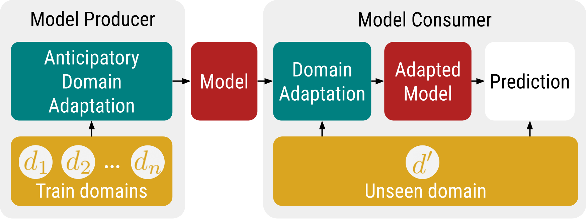

# modular-domain-adaptation

This is a framework to train and evaluate models using modular adaptation techniques as proposed in the paper Modular Domain Adaptation (TODO add link).



Using this framework, the model producer trains models using anticipatory domain adaptation techniques, and the model consumer uses the same techniques when evaluating and predicting with the model on a new domain, to address the domain misalignment issue without the need of releasing the training data. Please see the paper for further details.

## Installation

Clone this repository and at the repo root run

```
pip install -e .
```

CUDA GPUs are supported and used if detected. We recommend using conda and install in a conda environment.

When using newer CUDA versions, please first install the correct version of `torchvision` with as instructed at pytroch's [installation page](https://pytorch.org/get-started/locally/) using pip, before using `pip install -e .`.

## Getting Started

Please see the [demo section](./demo) for usage of the main APIs.

## Pretrained Models

We [release](https://drive.google.com/drive/folders/1mu2k7PpHoR2Xe_Yyh5CSNfe3WWh0F8ft?usp=sharing) a logistic regression and a RoBERTa model pretrained using all domains in the train split of Media Frames Corpus. 

 - The logistic regression model is released in the form of a lexicon csv, it is trained using domain-specific normalization and domain-specific bias.
 - The RoBERTa model in the form of a torch state dict checkpoint, it is trained using domain-specific bias. 

Please follow the example in `demos` to load, eval, and predict witht them. 

## Citing Modular Domain Adaptation

TODO
